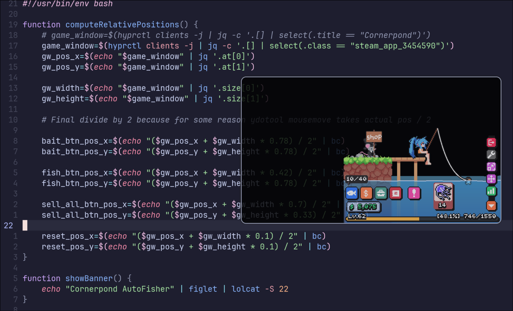

# 🎣 cornerpond-afk

Simple Linux autoclicker for [Cornerpond](https://store.steampowered.com/app/3454590/Cornerpond/) idle game on Steam.



## Dependencies

This was made for my very specific use case so you might need to modify it a bit.

Required:
- hyprctl ([Hyprland WM](https://hyprland.org/)): finding game window, position and size
- [ydotool](https://github.com/ReimuNotMoe/ydotool): programmatically move mouse and trigger clicks 
- [jq](https://github.com/jqlang/jq): easy-to-use JSON processor
- [GNU bc](https://www.gnu.org/software/bc/): for maths because it seems `bash` cannot do floating point multiplications

Optional:
- [figlet](http://www.figlet.org/): convert text to ASCII art banner
- [lolcat](https://github.com/busyloop/lolcat): apply rainbow colors to text

## Usage

Simplify run the script with `-o` for running once or `-l` for looping forever.
In forever mode, you can simply abort the script with `CTRL+C`.

```console
coko7@example:~$ ./cornerpond-afk.sh -h
Usage: cornerpond-afk.sh OPTION

-h, --help        display this help text and exit
-l, --loop        launch in forever loop mode
-o, --once        launch only once
```

## Running `Cornerpond` on Linux?

As I write this, Cornerpond is not officially supported on Linux but using [Steam Proton](https://www.protondb.com/), it runs alright.

The only tweak I've had to do on my side was to launch it with `--rendering-method mobile` to force the game screen to clear previously drawn sprites.
